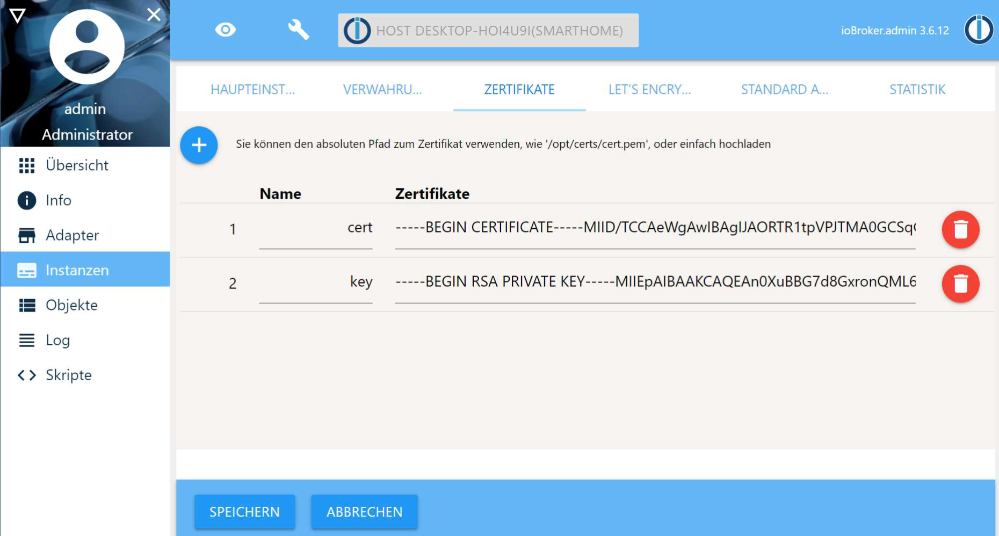
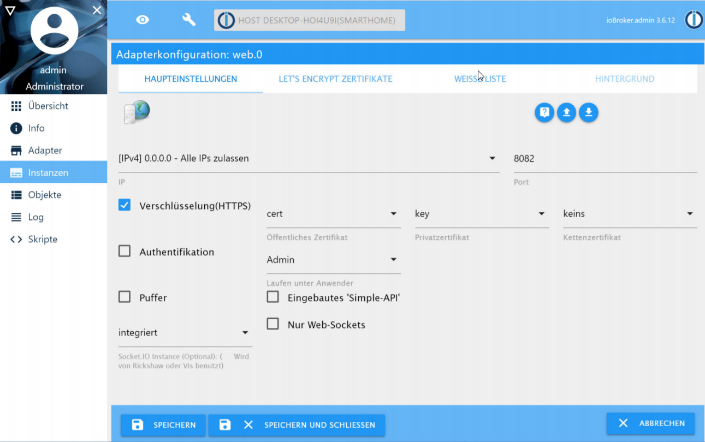

# SIP Adapter for ioBroker

Widget to enable SIP communication with asterisk.

## Preparation

### Install Asterisk

Execute the installation script from 'scripts/asterisk':   
./install-asterisk.sh  
-> Enter the IP address of the device   
-> Confirm further actions   

Install the created CA certificate in the browser you will use asterisk with.

The certificate is valid for 800 days. You can use the "renew-asterisk-cert.sh" to renew the certificate.

### Activate HTTPS for ioBroker

Execute the ioBoker certificate script from 'scripts/ioBroker':   
./init-ioBoker-cert.sh  
-> Enter the IP address of the device   

Install the created CA certificate in the browser you will use ioBroker with.

The certificate is valid for 800 days. You can use the "renew-ioBroker-cert.sh" to renew the certificate.

Add the certificate and private key in certificate tab in the ioBroker system view.   

Configure the Web adapter to activate HTTPS and use the added certificate and private key.

## Install the Adapter

Install this adapter in ioBroker and add the widget to your visualization.

## Configure the SIP clients

Open the visualization and enter the follwoing data into the popup:

Private Identity: 1060 or 1061
Public Identity: sip:1060@ipAddress or sip:1061@ipAddress  
Passwort: password   
Anzeigename: arbitrary  
Realm: ipAddress   
Websocket Proxy URL: wss://ipAddress:8089/ws

Use the follwing data for classic SIP clients:

Domain: ipAddress   
Username: 6000 or 6001   
Password: SmartHome!   
Tranport: UDP (Port 5060)   

Replace "ipAddress" with the IP address of your asterisk server.

You can define futher SIP accounts by editing the asterisk configuration (pjsip.conf + extensions.conf)

## More Information

In the doc directory you can find a german documentation which descripes the configuration and installation process and the use with a doorbird door intercom in detail.   
Further information about asterisk can be found on the offical asterisk webpage: wiki.asterisk.org

